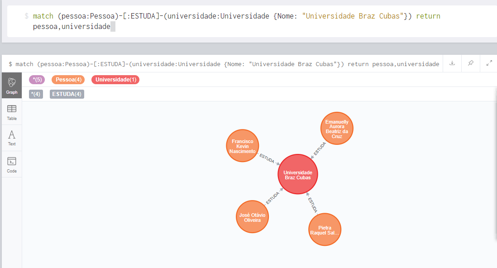
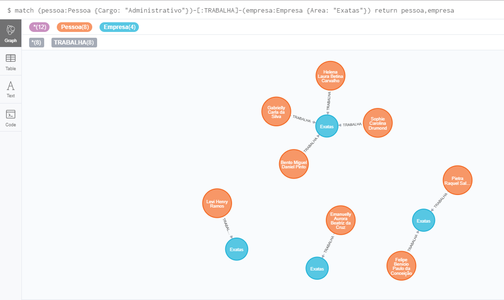
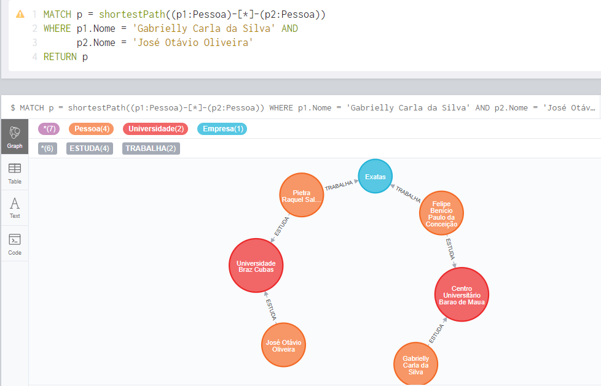

#  MBA - Artifical Intelligence & Machine Learning

#### Cintia Akie Nakano . RM 333603 // Lennon V. Alves Dias . RM 334415 // Mateus Aguiar Florentino . RM 334444

<h1 align="center">
    Estudo prático de um banco de dados em grafos
</h1>

## 💪 Motivação

Atualmente, uma rede de contatos de um profissional é muito relevante, principalmente em eventos corporativos. A importância de ter conexões no mesmo ramo de conhecimento traz benefícios, tais como: comunicação com pessoas que entendem do assunto e possíveis dúvidas podem ser esclarecidas, indicações de trabalhos disponíveis, entre outros. Sendo assim, o grupo se inspirou nessa situação próxima da realidade, para demonstrar a conexão de pessoas no mercado de trabalho através de um banco de dados gerado aleatoriamente utilizando a técnica de grafos, que é extremamente visual e consequentemente fácil de ser interpretada.

## 👩‍🏫 Introdução

Uma empresa multinacional de tecnologia decide realizar um evento em escala mundial, com objetivo de apresentar e vender o seu novo portfólio, com diversas palestras, mesas redondas e stands com as maiores referências de especialistas no mercado. Além disso, o evento também busca conectar pessoas dessa área, visto que existem ramificações bem específicas tais como: exatas, biológicas e humanas.

Sendo assim, todo participante que realiza a inscrição no evento , ele deverá incluiro seu Linkedin na ficha cadastral. A partir dessa página, é possível extrair algumas informações tais como: emprego atual e anteriores, áreas de conhecimento, área de atuação, local de estudo, etc. Com os dados, temos uma rede de contatos que pode ser estruturada utilizando a última metodologia vista em sala de aula na disciplina de arquitetura de dados: banco de dados em grafos.

O termo “grafo” vem do uso da palavra na matemática. É usada para descrever uma coleção de nós, ou vertentes, que contém informações  e relações classificadas entre os nós. O banco de dados de grafos é pouco conhecido e difundido entre as empresas hoje em dia, e é utilizado para trabalhar com dados altamente interconectados, em que eles podem ser descritos como bancos mais “relacionais” do que uma típico banco de dados relacional. Isso por que as bases de grafos brilham quando o objetivo é capturar relações complexas em redes de informações. Portanto, no caso descrito acima, em que haja a necessidade de lidar com milhões de relaçãoes – amigos de amigos – essas consultas se enciaxam muito bem.


## 👫 Relações do banco de dados

Os bancos de dados de grafos funcionam melhor quando os dados com os quais se está trabalhando são altamente conectados e devem ser representados a partir de como se conectam ou se correlacionam com outros dados, normalmente por meio de relações ‘muitos para muitos’.
Associando a descrição de uma rede utilizando banco de dados de grafos, imagine que as pessoas na rede seriam os nós, os atributos de cada pessoa (como nome, idade, estado que reside, universidade que estudou, área de conhecimento, etc) seriam as propriedades, e as linhas conectando as pessoas com classificações como director, gerente, supervisor, analista indicariam as suas relações.

Como os nós relacionados são fisicamente ligados à base de dados, acessar essas relações é algo tão imediato quanto acessar os dados em si, e em vez de calcular a relação, como as bases de dados relacionais funcionam, as bases de dados de grafos simplesmente fazem a relação instantaneamente a partir do armazenamento. A quantidade de trabalho necessária para construir e exibir as visualizações de dados encontradas em redes sociais é menor, como determinar se você conhece ou não uma determinada pessoa por conta da proximidade que ela tem com outros amigos seus na plataforma. Outra aplicação para eles é encontrar padrões de conexão em dados que seriam difíceis de visualizar por meio de outras representações de dados.

De forma geral, os bancos de dados de grafos são uma combinação natural para aplicações que gerenciam relações ou interdependências entre entidades. Você normalmente vai encontrar bancos de grafos por trás de sistemas de recomendações, sistemas de gerenciamento de conteúdos e assets, sistemas de gerenciamento de acesso e identidade, etc.

## 🕵‍♂ Consultas

Realizando consultas ao banco de dados criado, evidencia-se 3 análises possíveis dentro do contexto desenvolvido.

* Quais pessoas do evento estudam na mesma universidade que Pietra (Universidade Braz Cubas)?

```
MATCH (p1:Pessoa)-[:ESTUDA]-(u1:Universidade {Nome: "Universidade Braz Cubas"}) RETURN p1, u1
```



* o	Se eu estiver no evento e gostaria de me consultar com um especialista ou diretor de uma área x, quais são as pessoas mais indicadas? (Exemplo: Administração -> Exatas)

```
MATCH (p1:Pessoa {Cargo: "Administrativo"})-[:TRABALHA]-(e1:Empresa {Area: "Exatas"}) RETURN p1, e1
```



* o	José Otávio é especialista na área de Biológicas e Gabriela está iniciando seu conhecimento sobre o assunto e ficou interessada em bater um papo com José. Qual o caminho mais curto que Gabriela precisa para contatar José?

```
MATCH p = shortestPath((p1:Pessoa)-[*]-(p2:Pessoa))
WHERE p1.Nome = 'Gabrielly Carla da Silva' AND
      p2.Nome = 'José Otávio Oliveira'
RETURN p
```



Link do repositório com códigos da aplicação utilizada: [https://github.com/lennonalvesdias/fiap-8ia-arquitetura-de-dados](https://github.com/lennonalvesdias/fiap-8ia-arquitetura-de-dados). Nesse link você pode encontrar o código em `Python` utilizado para gerar e relacionar a base.